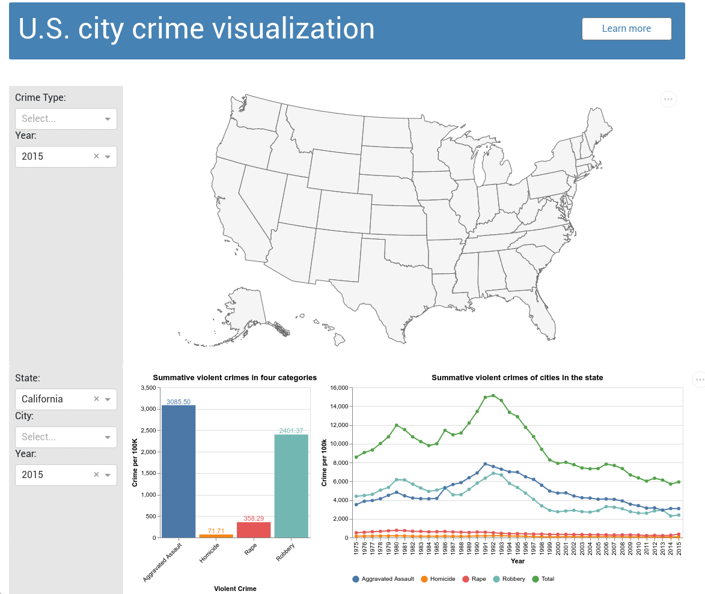

# Violent Crime Visualizer in US Cities
## Team members: 
- Fei Chang [@fei-chang](https://github.com/fei-chang)
- Mengyuan Zhu [@Julie-M-Zhu](https://github.com/Julie-M-Zhu)
- Jingjing Zhi [@zhijingjing1](https://github.com/zhijingjing1)
- Pan Fan [@pan1fan2](https://github.com/pan1fan2)

## Description of App

Deployed dashboard on heroku: https://mds-crimeviz.herokuapp.com/

The interactive app contains a landing page that shows a U.S. map, a bar chart and a line chart. The data visualization tool sums up the number of crimes per 100k capita in four categories and a total number of violent crimes. The app aims to facilitate people for assessing the safety in the selected state and/or city. 

The map can first provides a quick view on how each type of crimes is distributed in U.S. on a specific year.Then the bar chart provides a detailed result for each city. The line chart serves the purpose of showing the evolution of each crime type together with the total violent crimes.

The map is by default set to show the background map of U.S. cities, the bar chart is by default set to show the summative results of the state of California at 2015 and the line chart is to show the evolutions of summative results of the state of California.

The app allows users to filter out the specific information geographically and chronologically from the dropdown and slider bar menus below the line chart. For example, a user can find the state of interest from the `State` dropdown menu. After picking a state, the user can also specify a city/county in the state from the `City` dropdown menu. Furthermore, the user can specify the time period to display the line chart from the slider bar. Probably, the crime data over the recent decade are more informative.

In general, the dashboard can clearly display the numbers of violent crimes in selected state and city.

## Display of the dashboard

## Requirements

Please check the [requirements](https://github.com/UBC-MDS/mds532_viz_group25/blob/main/requirements.txt) in this repo.

## License

Please refer to the License File [here](https://github.com/UBC-MDS/mds532_viz_group25/blob/main/LICENSE)
